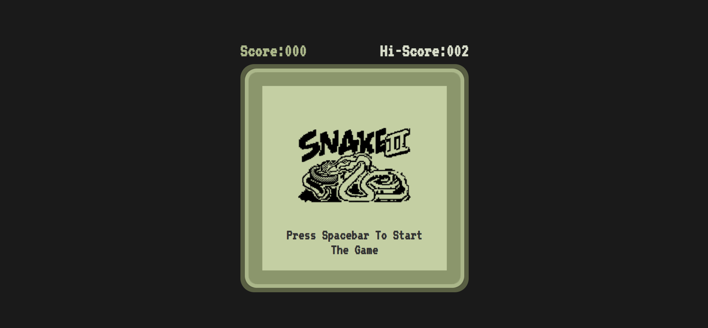

<br/>
<p align="center">
  <a href="https://github.com/Shahbaazx786/Snake-Xenzia">
    
  </a>

  <!-- <h3 align="center">Tracker.io</h3> -->

  <p align="center">
  The All-time favorite Snake Retro Game
    <br/>
    <br/>
    <a href="https://tracker.io-neon.vercel.app/">Play it now!</a>
    |
    <a href="https://github.com/ShahbaazX786/Tracker.io/issues">Report Bug</a>
    |
    <a href="https://github.com/ShahbaazX786/Tracker.io/issues">Request Feature</a>
  </p>
</p>


#### About The Project



This is the best game we could play in the retro phones.

#### Built With
- HTML
- CSS
- JS (Dom Manipulation & JS Events)

#### Getting Started

Just click on **Play Now** button to test it out real quick.
- However if you want to experience it in detail then go ahead and clone it in your pc.

#### Prerequisites:

> Your will need these in order to run this project in your pc:
- Vs code.
- Live Server vs code extension.

#### Installation:

1. Clone the repo

```sh
git clone https://github.com/ShahbaazX786/Snake-Xenzia.git
```

2. Right click on index.html file and select **open with Liveserver**

3. Play it in your browser.

#### Credits:

> This is just a basic approach on and its sole purpose is to be an educational project. I don't own the logo nor the idea of the game.

#### Improvements:
checkout Contribution.md file.